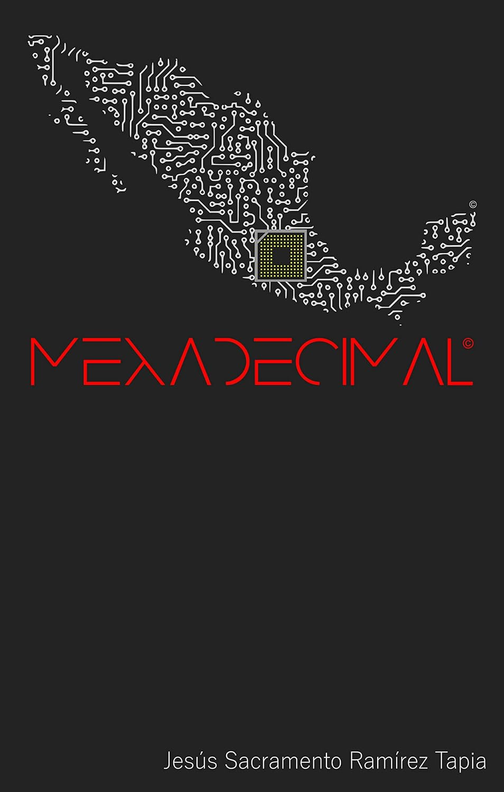

<!DOCTYPE html>
<html lang="es">
<head>
    <meta charset="UTF-8">
    <meta name="viewport" content="width=device-width, initial-scale=1.0">
    <title>Mexadecimal - Cyberpunk en México</title>
    <meta name="description" content="Descubre 'Mexadecimal', el libro de ciencia ficción cyberpunk que muestra a México en el año 2065 y su infernal sociedad. Autor: Jesús Sacramento Ramírez Tapia.">
    <meta name="keywords" content="cyberpunk, libro ciencia ficción, mexadecimal, Jesús Sacramento Ramírez Tapia, Jesús Ramírez, distopía, sociedad mexicana, México, futuro distópico, ciberpunk, 2065">
    <meta name="author" content="Kaito Nakamura">
    
</head>
<body>
    

        <header>
            <h1 class="logo">
                <a href="https://www.ejemplo-libro-cyberpunk.com" target="_self">MEXADECIMAL©</a>
            </h1>
            <a href="https://www.amazon.com.mx/Mexadecimal-Jes%C3%BAs-Sacramento-Ram%C3%ADrez-Tapia-ebook/dp/B08Q7D4DR7/ref=sr_1_1" class="cta-button" target="_blank">COMPRAR AHORA</a>
            <!--<a href="https://www.ejemplo-comprar-libro.com" class="cta-button" target="_blank">ENGLISH</a> -->
            <a href="https://mx-z.mx" class="cta-button" target="_blank">Saga MX-Z©</a>
        </header>
        
        <main>
            <section class="main-content">
                

                    
                

                
                

                    <h2 class="book-title">Mexadecimal©</h2>
                    
                    

                        

                            ¡Oh vosotros los que entráis, adandonan toda esperanza! México, 2065.
                         
                            "Desde cualquiera de las estaciones orbitales, la zona central de México semejaba un descomunal núcleo computacional cuántico." 
                         
                            El avance de la tecnología ha dejado atrás a cualquier ley que ha intentado regularla. El calentamiento global ha provocado migraciones masivas hacia los interiores de los países. La verdad ha dejado de ser válida. La sociedad se ha reajustado para adoptar nuevas formas de exitencia. La tecnología está en nuestros cuerpos. La supervivencia, en nuestras almas. 
                             
                            Mexadecimal© es la primera novela de Jesús Ramírez, autor de la revolucionaria Saga MX-Z© que trata sobre una epidemia zombie en México.
                        

                    

                    
                    

                        

                            Autor:
                            Jesús Sacramento Ramírez Tapia.
                        

                        

                            Género:
                            Cyberpunk, Ciencia Ficción Mexicana.
                        

                    

                

            </section>

        </main>
        
        <footer>
            
© 2020 Jesús Sacramento Ramírez Tapia. Todos los derechos reservados.

            <!--
           
.
 
        --> 
        </footer>
    

</body>
</html>
